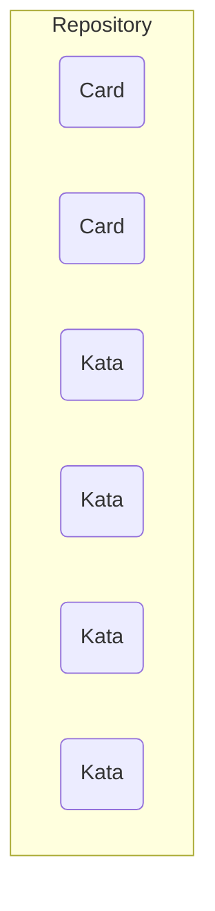
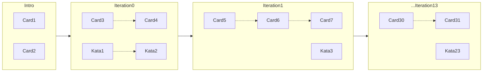

# Prerequisites

- Leveraging the power of Open Source and Creative Commons, because knowledge should always be free
- Create structure for the learning text and the learning katas
- hence, make them machine readable and i.e. transformable

# Architecture

## Idea

- cards representing learning content for the learner
- katas representing small exercises for the learner
- mix & match:
  - a bigger lernOS guide provides more structure through iterations etc
  - search for tags i.e. "weekly-review" and you can individually mix the learning content

## Learning repository



A repo consists of

- cards: bite-sized content for the learner. Can contain front / back content, short and long content
- katas: katas for self-improving on the topic

Every element is one file, based on

- YAML code for configuration, meta data
- Markdown language for content: easy to learn, portable, extendable, transformable

## Repo file structure

```
`- REPONAME
  README.md
  `- de_DE/
    `- cards/
      `- card-bla-bla.md
      `- card-bla-blubb.md
    `- katas/
      `- kata1.yaml
      `- kata2.yaml
    `- README.md
```
## Example card

Shall we go the .md route or structure it as a YAML file with markdown integrated?

## Example Kata

A kata is a YAML file which has all the markdown in it. The kata structure goes as follows:

```
---
meta:
  author: "Björn Schotte"
  email: bjoern.schotte@mayflower.de
  version: 0.1

kata:
  id: ab1b3f13-006b-4507-ab7e-e7dc09662c03
  title: "Dies ist meine erste Kata!"
  description: "While this is bla bla, this is bla bla"
  tags:
    - "eins"
    - "zwei"
    - "drei"
  difficultyLevel: "Immediate"
  timeToPractice: 60
  goal: |
    Diese Kata ist eine Test-Kata, und diese geht
    über mehrere Zeilen.
    Sogar ganze Absätze. Und noch ein Text.
  steps:
    - "First, do this"
    - |
      Then, do that
        1. and that
        2. and this
  outroSteps: |
    Hier sind ein paar nützliche Tipps. Du kannst natürlich schauen, was du daraus machst.
    Auch wenn das unklar ist, so geht dies über mehrere Zeilen.
  checks: ""
  links:
    -
      title: "Mayflower"
      url: "https://mayflower.de/"
      comment: "Hier findest du tolle Dinge für Agile Softwareentwicklung"
    -
      title: "Heise Online"
      url: "https://heise.de/"
---
```

## lernOS guide

A lernOS guide takes one or more learning repositories and provides a learning path for the learner on a specific topic.



The guide itself provides YAML based configuration data, i.e.

- which learning repos to include
- how many iterations you designed
- which content (cards, katas) will be placed on which iteration
