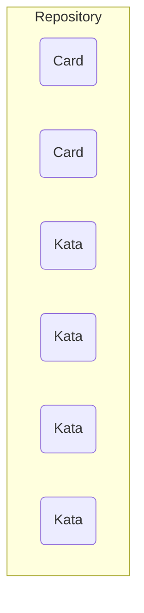

# Prerequisites

- Leveraging the power of Open Source and Creative Commons, because knowledge should always be free
- Create structure for the learning text and the learning katas
- hence, make them machine readable and i.e. transformable

# Architecture

## Idea

- cards representing learning content for the learner
- katas representing small exercises for the learner
- mix & match:
  - a bigger lernOS guide provides more structure through iterations etc
  - search for tags i.e. "weekly-review" and you can individually mix the learning content

## Learning repository



A repo consists of

- cards: bite-sized content for the learner. Can contain front / back content, short and long content
- katas: katas for self-improving on the topic

Every element is one file, based on

- YAML code for configuration, meta data
- Markdown language for content: easy to learn, portable, extendable, transformable

## Repo file structure

```
`- REPONAME
  README.md
  `- de_DE/
    `- cards/
      `- card-bla-bla.md
      `- card-bla-blubb.md
    `- katas/
      `- kata1.md
      `- kata2.md
    `- README.md
```

## lernOS guide

A lernOS guide takes one or more learning repositories and provides a learning path for the learner on a specific topic.

The guide itself provides YAML based configuration data, i.e.

- which learning repos to include
- how many iterations you designed
- which content (cards, katas) will be placed on which iteration
